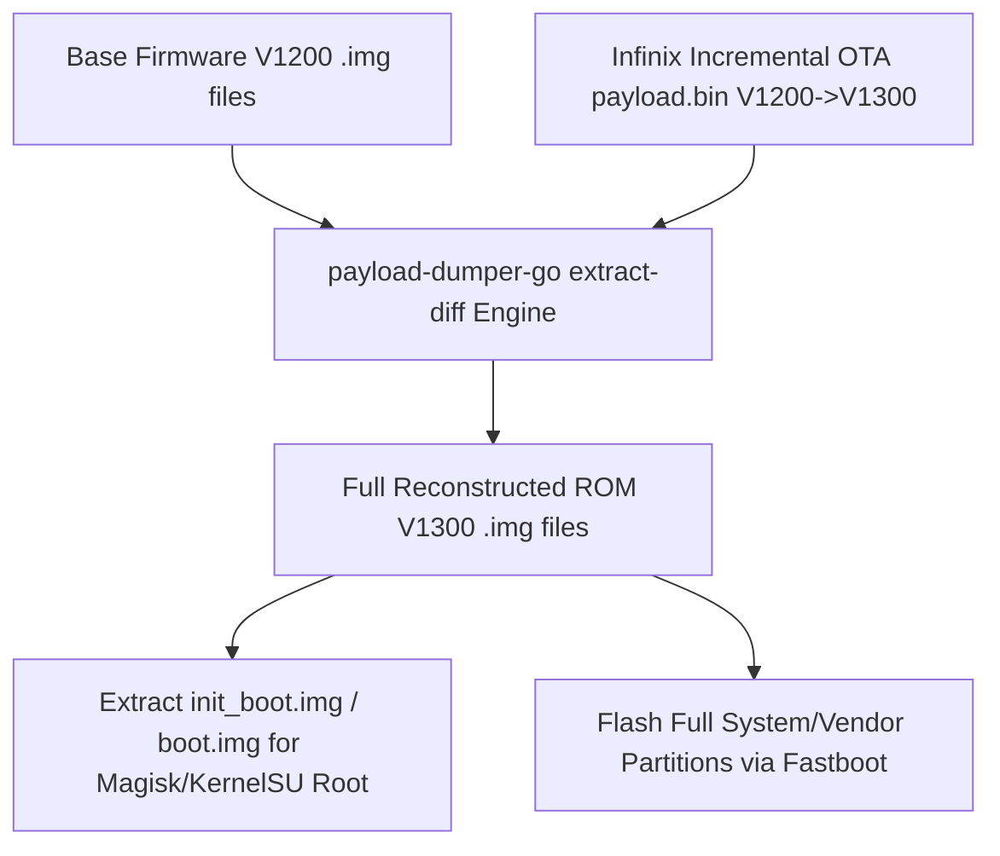

# Cloud-Powered Android OTA Payload Extractor & Incremental-to-Full ROM Builder
### Targeted for Infinix GT 20 Pro (X6871) — MediaTek Dimensity 8200 Ultimate (MT6896 / MT6895) & Transsion Devices

High-performance, automated tool to probe Transsion update servers, download Android OTA packages, and convert **Incremental (Delta) OTAs into 100% complete Full ROM partition images** (`init_boot.img`, `vendor_boot.img`, `system.img`, `vendor.img`, `product.img`, `vbmeta.img`) using cloud-powered GitHub Actions servers.

---

## Technical Deep-Dive for Infinix GT 20 Pro (X6871)

### 1. Chipset & Partition Layout
- **Device**: Infinix GT 20 Pro (X6871)
- **SoC**: MediaTek Dimensity 8200 Ultimate (`MT6896` / `MT6895`)
- **Android Architecture**: Virtual A/B with EROFS / LZ4 compression
- **Key Partitions**:
  - `init_boot.img` (Contains ramdisk for Magisk / KernelSU root on Android 13/14)
  - `vendor_boot.img` (Contains device device-tree blobs DTB and vendor ramdisk)
  - `boot.img` (Contains GKI Linux kernel)
  - `system.img`, `vendor.img`, `product.img`, `system_ext.img`, `odm.img`

---

### 2. How Incremental-to-Full ROM Rebuilding Works
Transsion frequently issues small **Incremental OTAs** (300MB – 1.5GB) for XOS updates. Standard payload dumpers cannot turn an incremental package into flashable partition images without base files.

Our workflow solves this by running a **Block-Level Delta Patching Engine**:



1. **Input Base Images**: Original partition files from previous build (`X6871-V1200`).
2. **Input Delta Payload**: Incremental `payload.bin` from Transsion update (`X6871-V1200_to_V1300`).
3. **Patching Engine**: Executes block operations (BSDIFF, PUFFDIFF, ZSTD, LZ4) against base images to generate the new build (`X6871-V1300`).
4. **Output**: Full, flashable `.img` partition set for the target version.

---

## Project Structure

```
OTA Extract/
├── .github/
│   └── workflows/
│       ├── ota_extract.yml       # Cloud extraction GitHub Actions workflow
│       └── cleanup_runner.sh     # Free up ~40GB disk space on GitHub runner
├── bin/
│   └── setup_dumper.sh           # Installs payload-dumper-go & tools
├── scripts/
│   ├── extract_ota.sh            # Extraction engine (Full & Incremental)
│   ├── probe_infinix.py          # Transsion OTA API prober for Infinix X6871
│   └── upload_output.sh          # Delivery engine (GitHub Release, Pixeldrain)
├── reference_repos/
│   └── transsion-ota-prober/     # Cloned reference repo by ramabondanp
├── local_trigger.py              # CLI tool for triggering remote cloud workflow
└── README.md                     # Documentation
```

---

## How to Use

### 1. Probe Transsion Servers for Infinix GT 20 Pro (X6871) Links
Run the local prober script:
```bash
python scripts/probe_infinix.py X6871-V1200
```

### 2. Convert Incremental OTA to Full ROM (via GitHub Actions Cloud Server)

#### Via Local CLI (`local_trigger.py`):
```bash
python local_trigger.py \
  -u "https://transsion-ota-link.com/X6871_incremental.zip" \
  -t INCREMENTAL \
  -b "https://transsion-ota-link.com/X6871_base_firmware.zip" \
  -dest release
```

#### Extracting Only Rooting Partitions (`init_boot`, `vendor_boot`):
```bash
python local_trigger.py \
  -u "https://transsion-ota-link.com/X6871_ota.zip" \
  -p "init_boot,vendor_boot,boot,vbmeta" \
  -dest pixeldrain
```

---

## References & Cloned Repositories
- [`reference_repos/transsion-ota-prober`](file:///C:/Users/Admin/Videos/Github/OTA%20Extract/reference_repos/transsion-ota-prober) - Official Transsion OTA Prober by `ramabondanp`.
- [xishang0128/payload-dumper-go](https://github.com/xishang0128/payload-dumper-go) - Go-based incremental diff extractor engine.
