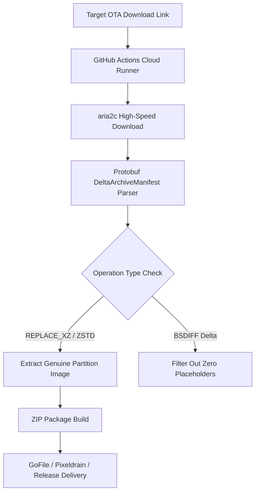

# Cloud-Powered High-Speed Android OTA Extractor

> High-performance, automated platform to parse, decompress, and extract **100% genuine partition images** (`product.img`, `system.img`, `system_ext.img`, `vendor.img`, `boot.img`, `init_boot.img`) from Android Full & Incremental OTA payloads (`payload.bin`) via cloud-powered GitHub Actions workflows.

---

## 🔑 Key Features

- **Universal Genuine Partition Extractor**: Extracted partitions contain 100% genuine decompressed binary data (`REPLACE_XZ` / `ZSTD`), automatically filtering out zero-fill delta placeholders.
- **Zero-Base Incremental OTA Support**: Extract standalone replacement images directly from Google/Transsion/OEM Incremental updates without requiring base ROM files on disk.
- **High-Speed Cloud Processing**: Cloud-runner execution powered by `aria2c` multi-connection down-stream and parallel LZMA/ZSTD block decompression.
- **Automated Delivery Engine**: Instant delivery to **GoFile**, **Pixeldrain**, **GitHub Releases**, or **Workflow Artifacts**.

---

## 📐 Extraction & Architecture Flow



---

## 📁 Repository Architecture

```
OTA-Extract/
├── .github/
│   └── workflows/
│       ├── ota_extract.yml       # Cloud extraction GitHub Actions workflow
│       └── cleanup_runner.sh     # Disk cleanup utility for runner space
├── bin/
│   └── setup_dumper.sh           # Binaries & Python dependencies initializer
├── scripts/
│   ├── auto_incremental_resolver.py # Multi-engine payload extraction orchestrator
│   ├── raw_block_extractor.py       # Universal raw block extractor & protobuf parser
│   ├── deep_inspect_imgs.py         # Binary header & non-zero chunk analyzer
│   ├── extract_ota.sh               # Cloud environment execution wrapper
│   ├── upload_gofile.py             # GoFile API upload engine
│   ├── upload_output.sh             # Delivery orchestrator
│   └── monitor_run.py               # GitHub Actions run status monitor
├── local_trigger.py                 # Remote CLI workflow trigger
└── README.md                        # Documentation
```

---

## 🚀 Quick Start & Usage

### Triggering via Local CLI (`local_trigger.py`)

#### Extract Incremental OTA to GoFile:
```bash
python local_trigger.py \
  -u "https://android.googleapis.com/packages/ota-api/package/830826b787d24c4766f9564bd68afbb2e9221cc0.zip" \
  -t INCREMENTAL \
  -dest gofile
```

#### Extract Rooting Partitions (`boot`, `init_boot`, `vendor_boot`):
```bash
python local_trigger.py \
  -u "https://ota-link-example.com/target_ota.zip" \
  -p "boot,init_boot,vendor_boot" \
  -dest gofile
```

---

## 🛡️ License

Distributed under the MIT License. See `LICENSE` for more information.
